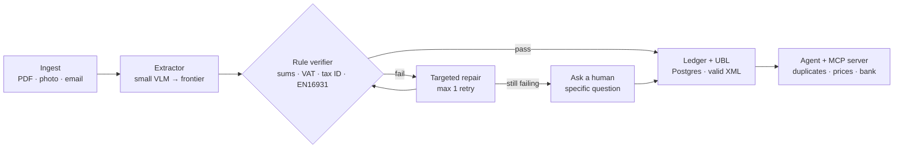

# Invariant — Architecture

Invariant turns messy business documents into verifiable accounting data. Business rules (invariants) act as an oracle: they decide when to accept, repair or ask a human, they measure quality without labels, and they become the reward for training a small model.

## Pipeline

Cross-cutting: Langfuse traces every step (cost, latency, rule scores), human corrections feed the golden set and the GRPO reward.

## Components

| Component | Package | Responsibility |
|---|---|---|
| Invoice contract | `@invariant/schema` | Shape of an invoice (Zod). No business rules. |
| Ledger | `@invariant/db` | Postgres system of record (Drizzle). Idempotent by file SHA-256. |
| Rule verifier | `@invariant/rules` | Business invariants; also served over HTTP as the RL reward. |
| Extractor | `@invariant/extractor` | VLM extraction and the small → frontier cascade. |
| E-invoice | `@invariant/ubl` | UBL generation and EN16931 validation. |
| Orchestration | `apps/api`, `apps/worker` | mastra workflows (suspend/resume for human review), queue consumer. |
| Observability & evals | `@invariant/observability`, `@invariant/evals` | Langfuse tracing, annotation queue, field-level accuracy, CI gate. |
| Agent | `@invariant/agent`, `@invariant/mcp-server` | Tools over the ledger, exposed via MCP. |
| Training | `python/training` | SFT + GRPO of a small VLM with rule-based rewards. |

## Key principles

1. **Shape vs. sense.** The schema validates structure; the rule verifier validates meaning. A parseable but inconsistent extraction is not discarded: it is repaired or escalated.
2. **Never fail silently.** Every document ends as `valid` or with a specific question in `needs_review`.
3. **Money is integer cents.**
4. **Idempotency.** The same file (same SHA-256) is processed once.
5. **Workflow first, agent where it adds value.** See ADR-0002.
